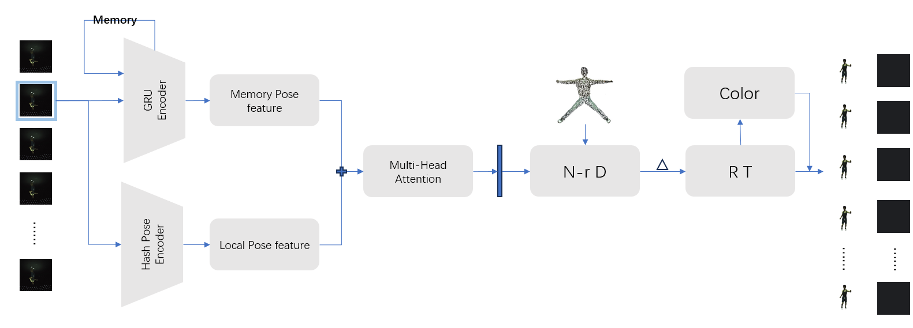
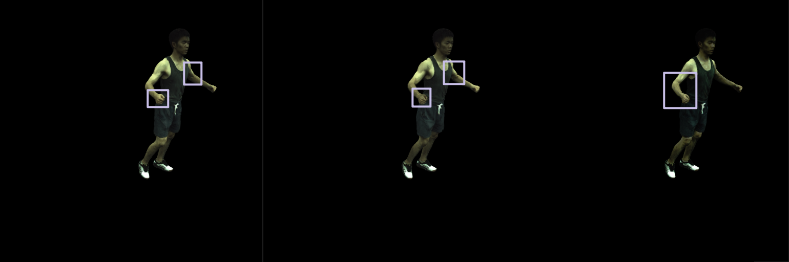
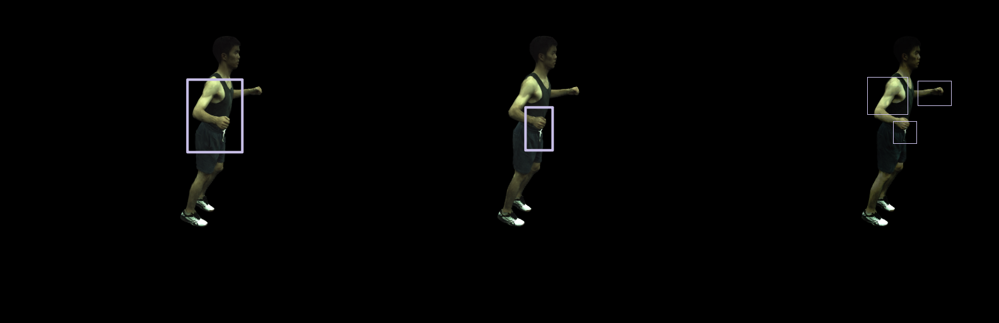
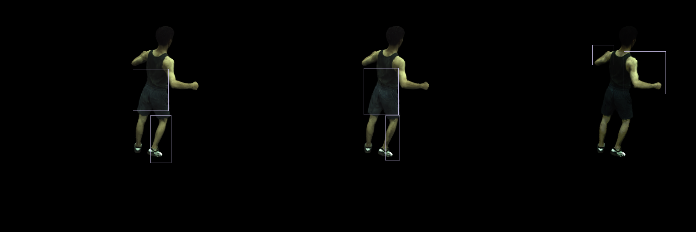
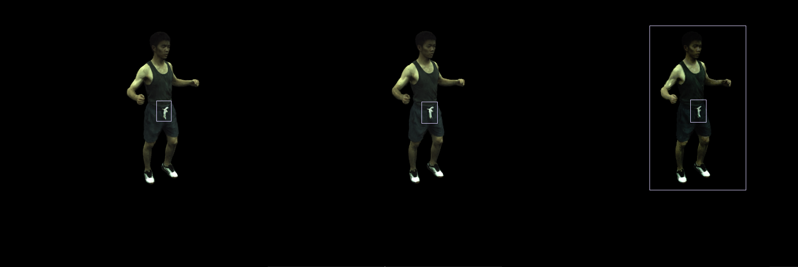
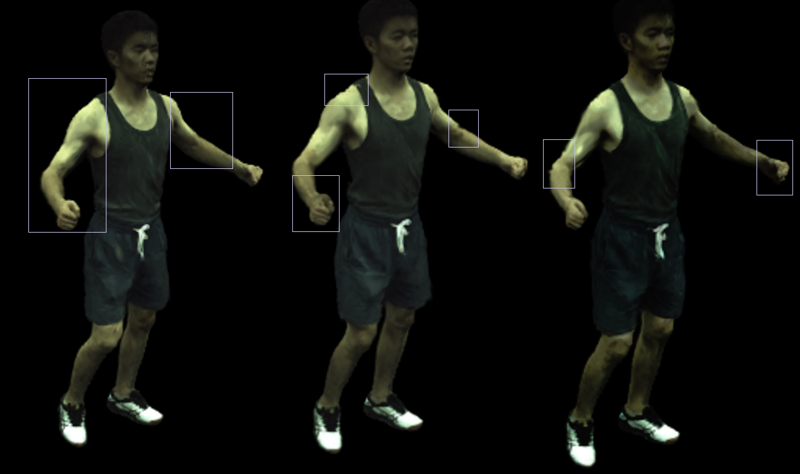
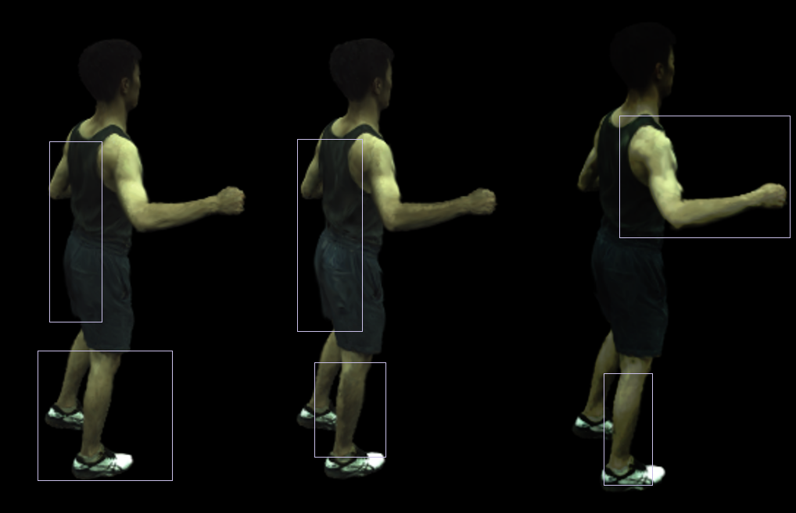
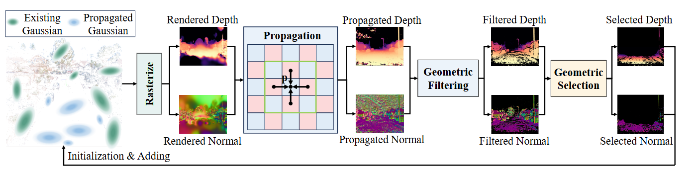

<h1>周报</h1>

## 1、上周流程图

**问题分析：**上周总觉得这个流程有问题，效果也不是太好。上周组会学长提出的注意力模块混乱问题，我做了修改，并尝试跑出结果，视觉效果比较差。

针对以上结果我分析了一下，GRU出来的特征都是受其他历史帧所影响的，这里没有特别突出当前帧的局部特征，导致视觉上的渲染效果看起来不太好。想了一下这周做了以下修改：

- 将GRU作为一个单独的编码器，用来出与历史帧有联系的特征；
- 使用Hash编码器对当前帧的姿势进行编码，作为当前帧的局部特征；
- 利用以上两个特征结合，做多头自注意力进行特征增强；

## 2、修改后流程图

**以下是效果对比：**

| 本周改进结果 | 无帧间关系模块 | 上周修改后结果 |
| :----------: | :------------: | :------------: |

<h1>GaussianPro: 3D Gaussian Splatting with Progressive Propagation</h1>

文章《GaussianPro: 3D Gaussian Splatting with Progressive Propagation》提出了一种改进的3D高斯技术，名为GaussianPro，用于解决传统3D Gaussian Splatting（3DGS）在大规模场景中难以优化的问题，尤其是在纹理较少的区域。

## 方法和流程

### 1. 问题描述
传统的3DGS技术依赖于由运动结构（SfM）技术生成的初始点云。然而，当处理包含大量纹理较少表面的场景时，SfM技术往往无法生成足够的点，这会导致3DGS优化困难和低质量渲染。

### 2. 方法概述
GaussianPro采用一种渐进传播策略来引导3D高斯密化，旨在利用场景中现有的重建几何作为先验，通过块匹配技术生成具有准确位置和方向的新高斯。

### 3. 渐进传播策略
1. **初始3D高斯生成**：从输入图像中渲染深度和法线图，通过alpha混合积累3D高斯的位置和方向。
2. **迭代传播**：对每个像素，迭代传播其邻近像素的深度和法线值，以形成一组候选值。通过经典的块匹配技术，选择满足多视图光度一致性约束的最佳候选值。
3. **几何过滤和选择**：过滤出不可靠的传播结果，选择那些传播深度与渲染深度显著不同的像素，并将这些像素投影回3D空间，初始化为新的高斯。
4. **优化**：在优化过程中引入平面约束，使高斯更好地拟合真实的几何结构，进一步提高渲染质量。
